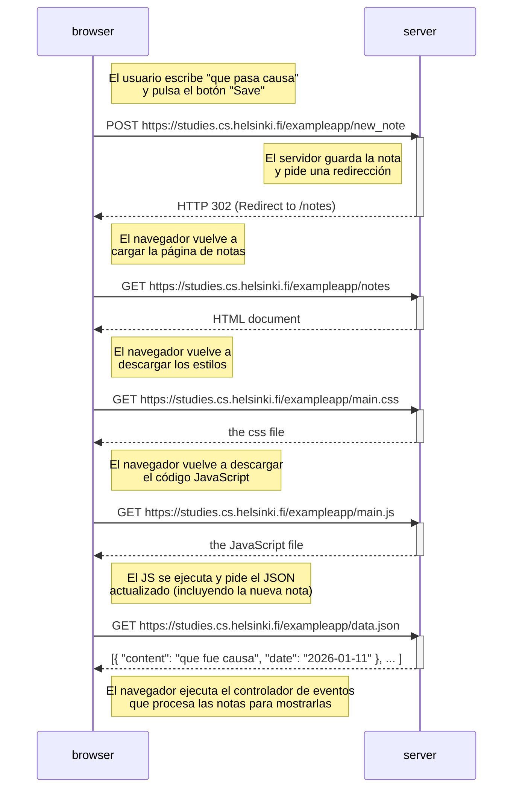

```mermaid
sequenceDiagram
    participant browser
    participant server

    Note right of browser: El usuario escribe "que pasa causa"<br/>y pulsa el botón "Save"

    browser->>server: POST https://studies.cs.helsinki.fi/exampleapp/new_note
    activate server
    Note left of server: El servidor guarda la nota<br/>y pide una redirección
    server-->>browser: HTTP 302 (Redirect to /notes)
    deactivate server

    Note right of browser: El navegador vuelve a<br/>cargar la página de notas

    browser->>server: GET https://studies.cs.helsinki.fi/exampleapp/notes
    activate server
    server-->>browser: HTML document
    deactivate server

    Note right of browser: El navegador vuelve a<br/>descargar los estilos

    browser->>server: GET https://studies.cs.helsinki.fi/exampleapp/main.css
    activate server
    server-->>browser: the css file
    deactivate server

    Note right of browser: El navegador vuelve a descargar<br/>el código JavaScript

    browser->>server: GET https://studies.cs.helsinki.fi/exampleapp/main.js
    activate server
    server-->>browser: the JavaScript file
    deactivate server

    Note right of browser: El JS se ejecuta y pide el JSON<br/>actualizado (incluyendo la nueva nota)

    browser->>server: GET https://studies.cs.helsinki.fi/exampleapp/data.json
    activate server
    server-->>browser: [{ "content": "que fue causa", "date": "2026-01-11" }, ... ]
    deactivate server

    Note right of browser: El navegador ejecuta el controlador de eventos<br/>que procesa las notas para mostrarlas
```

