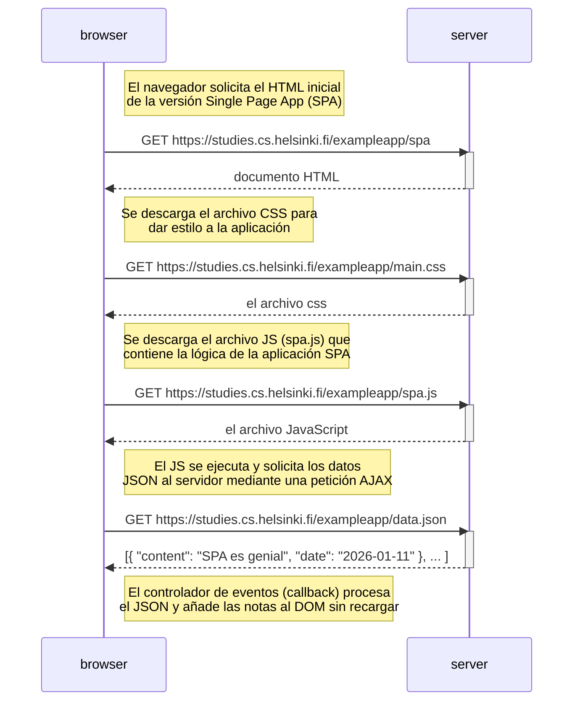

```mermaid
sequenceDiagram
    participant browser
    participant server

    Note right of browser: El navegador solicita el HTML inicial<br/>de la versión Single Page App (SPA)
    browser->>server: GET https://studies.cs.helsinki.fi/exampleapp/spa
    activate server
    server-->>browser: documento HTML
    deactivate server

    Note right of browser: Se descarga el archivo CSS para<br/>dar estilo a la aplicación
    browser->>server: GET https://studies.cs.helsinki.fi/exampleapp/main.css
    activate server
    server-->>browser: el archivo css
    deactivate server

    Note right of browser: Se descarga el archivo JS (spa.js) que<br/>contiene la lógica de la aplicación SPA
    browser->>server: GET https://studies.cs.helsinki.fi/exampleapp/spa.js
    activate server
    server-->>browser: el archivo JavaScript
    deactivate server

    Note right of browser: El JS se ejecuta y solicita los datos<br/>JSON al servidor mediante una petición AJAX
    browser->>server: GET https://studies.cs.helsinki.fi/exampleapp/data.json
    activate server
    server-->>browser: [{ "content": "SPA es genial", "date": "2026-01-11" }, ... ]
    deactivate server

    Note right of browser: El controlador de eventos (callback) procesa<br/>el JSON y añade las notas al DOM sin recargar
```
