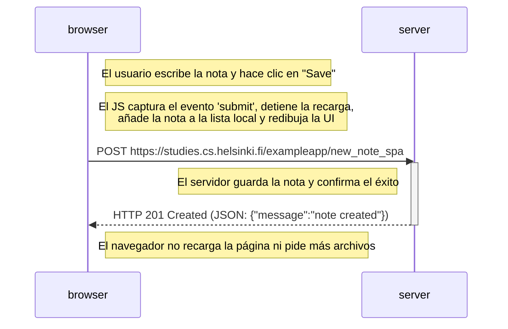

```mermaid
sequenceDiagram
    participant browser
    participant server

    Note right of browser: El usuario escribe la nota y hace clic en "Save"

    Note right of browser: El JS captura el evento 'submit', detiene la recarga,<br/>añade la nota a la lista local y redibuja la UI
    
    browser->>server: POST https://studies.cs.helsinki.fi/exampleapp/new_note_spa
    activate server
    Note left of server: El servidor guarda la nota y confirma el éxito
    server-->>browser: HTTP 201 Created (JSON: {"message":"note created"})
    deactivate server

    Note right of browser: El navegador no recarga la página ni pide más archivos
```
